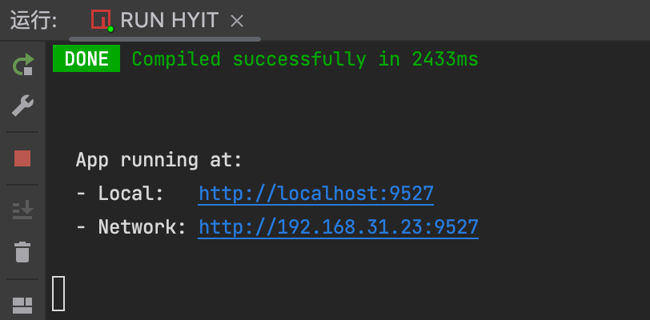
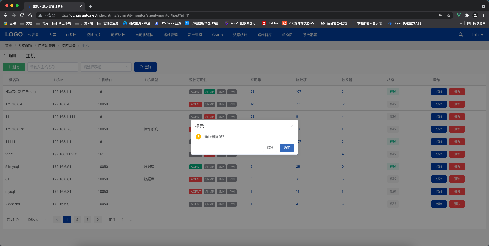
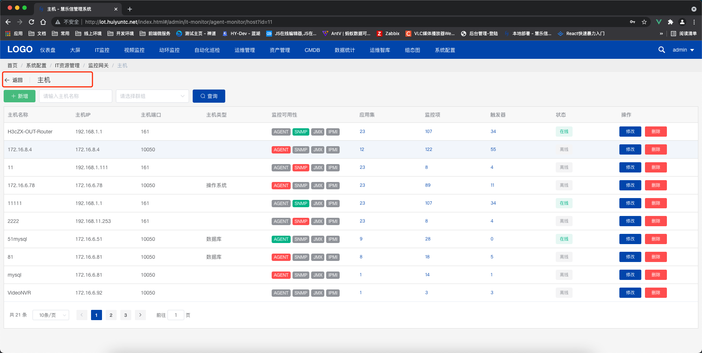

# 项目开发规范

*本项目语法一概使用ES6语法，开发的时候请注意es-lint语法检查，项目运行必须是 Compiled successfully 状态，不要有错误提醒或者是错误警告出现在终端。




## 常规语法注意点
### JavaScript
````
1、变量使用let、常量使用const
2、字符串使用单引号包起来，如：const name = 'name'
3、语句结束不用加 ;
4、对象元素最后一个属性不加 ,
如：
const obj = {
  name: 'name',
  WxInfo: {
    nickName: 'name',
    age: 23
  }
}
````
### 样式
#### 样式使用scss语法语法，并且每一个页面加上 scoped 禁止污染

## 命名
```
1、变量、方法使用小驼峰大驼峰的方式，如：getUserInfo
2、页面文件、页面文件夹、js、scss命名，小驼峰并且加上 "-"，如：user-content、user-content.vue、user-content.js
3、公共组件文件、公共组件文件夹命名，使用大驼峰，如：UserContentUserContent.vue
4、Vue文件，name名称使用大驼峰的方式，如：VideoConfig
```

## 接口请求
### 1、统一存放接口地址
接口的请求统一在 ``src/api/api.js`` 文件中注册接口地址，如：
````
  org: {
    insertHyitOrg: '/admin/insertHyitOrg'
  }
````
对象名称以功能模块划分，如系统菜单 ``sysMenu`` ，属性名称以接口名称命名，如新增区域接口 ``insertHyitOrg: '/admin/insertHyitOrg'``

### 2、使用request方法调用请求
````
this.$request({
  url: this.api.video.lableVideo, data: { cid: this.cid }
}).then(res => {
  if (res.code === 1) { // 请求成功
  
  } else { // 请求不成功
    Message({
      message: res.msg,
      type: 'error',
      duration: 5 * 1000
    })
  }
})
````

## 文件位置存放
### 1、图片/视频
图片文件存放在 ``public/image`` 文件夹，文件夹名称以功能模块名称命名，如仪表盘 ``dashboard``
### 2、js方法
``src/utils/utils.js`` 公共方法，项目里的一些公共方法写在这个文件中

``src/utils/validate.js`` 数据验证，比如对输入数据的验证，比如在表单中调用验证数据是否输入正确

``src/utils/browser-storage`` 浏览器存储操作方法 localStorage和sessionStorage

``src/utils/define-data`` 存放项目里一些前端的写死数据，用于如果多个页面会用到这个数据就直接写在这个文件里然后统一调用

``src/utils/require.js`` axios请求封装

``src/utils/websocket`` websocket连接

``src/utils/websocket-cmd`` 项目websocket统一发送方法，比如自动化运维运行脚本的socket发送可以封装方法写在这个文件里，在页面上调用
### 3、样式文件
1、样式文件存放在 ``src/styles`` 文件夹

2、样式文件全部使用scss语法

3、一些公共的样式，比如定义文字居中 ``.center { text-align: center }`` 这些样式存放在 ``src/styles/reset.scss`` 文件中

4、如果是重置一些组件的样式，请加上备注标注修改哪一个组件的样式
### 4、引入js文件资源
引入的js文件资源存放在 ``public/js`` 文件夹，文件夹名称以功能模块名称命名，如播放器 ``player``

## 关于项目前端权限控制
### 相关文件（非必要请勿修改，这个影响会比较大）
``/src/permission.js`` 权限控制业务逻辑文件

``/src/store/modules/permission.js`` 权限控制业务相关Vuex逻辑

``/src/store/modules/user.js`` 权限控制业务相关Vuex逻辑

``/src/directive/permission/permission.js`` 权限控制指令（绑定指令可对界面上的按钮进行控制显示或者隐藏）

## 公用组件
### 开发时有需要使用到以下组件时请使用以下组件，需要新增/修改公用组件请提前沟通，有新增请把组件也在本文档说明一下

``/src/components/AiTreeInput`` 级别选择框

``/src/components/QuillEditorComponent`` 富文本

``/src/components/ContextMenu`` 右击菜单

``/src/components/DragResize`` 让div可以修改位置以及大小的组件

``/src/components/Pagination`` 表格分页组件

``/src/components/TimePlan`` 时间模块组件

``/src/components/echart`` 大屏echarts组件 注意：后面做大屏应该会取消这个文件夹的，所以别去用这个组件！！！！！！！！

``/src/components/Upload`` 文件上传组件

``/src/components/TextTooltip`` 文字超出溢出处理


## 界面规范
### 开发过程中有以下结构的，请使用以下代码结构
### 表格
表格界面布局结构
````
<template>
  <div class="app-container">
    <div class="filter-container">
      <el-button v-waves v-permission="['Add']" class="filter-item" type="success" icon="el-icon-plus" @click="handleCreate">新增</el-button>
      <el-input v-model="listQuery.keyword" v-permission="['Search']" placeholder="请输入主机名称" style="width: 200px;" class="filter-item" clearable @keyup.enter.native="handleFilter" />
      <el-select v-model="listQuery.groupid" v-loadmore="loadMoreGroup" v-permission="['Search']" placeholder="请选择群组" clearable class="filter-item" style="width: 200px">
        <el-option v-for="item in zbxHstgrp" :key="item.groupid" :label="item.name" :value="item.groupid" />
      </el-select>
      <el-button v-waves v-permission="['Search']" class="filter-item" type="primary" icon="el-icon-search" @click="handleFilter">查询</el-button>
    </div>
    <div v-loading="listLoading" class="table-wrapper">
      <el-table>...</el-table>
      <pagination v-show="listQuery.total > 0" :total="listQuery.total" :page.sync="listQuery.page" :limit.sync="listQuery.limit" @pagination="findHyitHost" />
    </div>
  </div>
</template>
````

关键操作，要添加确认提醒框


### 内页需要添加页头
````
<el-page-header content="navTitle" @back="goBack" />
````


### 获取页面标题、路由参数使用计算属性去计算
````
computed: {
  // id，比如传递在地址栏的id
  id() {
    return this.$route.query.id
  },
  // 界面标题
  navTitle() {
    return this.$route.meta.title
  }
}
````

### 抽屉弹窗结构
````
<el-drawer
  title="新增关系"
  :visible.sync="drawerCmdbItemBox"
  direction="rtl"
>
  <div class="drawer-container">
    <div class="drawer-main">
      123
    </div>
    <div class="drawer-footer">
      <el-button type="primary" @click="saveCat">保存</el-button>
      <el-button type="default" @click="saveCat">取消</el-button>
    </div>
  </div>
</el-drawer>
````

### 弹窗结构
````
<el-dialog title="选择存储策略" :visible.sync="showBatchStrategyDialog" width="40%" top="5vh">
  <div class="dialog-body">
    
  </div>
  <div slot="footer" class="dialog-footer">
    <el-button @click="showBatchStrategyDialog = false">取 消</el-button>
    <el-button class="filter-item" type="primary" @click="batchActionChnStrategy">确 定</el-button>
  </div>
</el-dialog>
````

## 路由新增
##### 系统的路由由动态路由接管，所以新建完vue文件后要在系统中新增路由，并且授权才会生效，由于本地开发模式文件查找方式的不同每次新建完vue文件后请提交最新代码，并且通知其他同事不然其他同事会运行不了项目！

### 路由类型：菜单、按钮

菜单：指的就是路由

按钮：页面上的按钮，需要权限控制的按钮

### 1、新建路由
必填字段：

1、菜单名：就是你这个页面的中文名称

2、上级菜单：你这个路由挂载在哪一个菜单下

3、显示/隐藏：一些内页需要设置为隐藏，比如编辑新增页面，不然会在菜单显示出来

4、菜单地址：路由地址，最外层的地址需要加 / 符号

5、组件：vue文件地址

6、菜单标识：vue文件名称，前端定义的，比如 Login ，后续跳转到这个页面使用 ``this.$router.push({ name: 'Login' })`` 方法跳转

7、访问接口：这个页面访问的接口

前端开发的时候收到接口文档后请填上去，不然后面后端的接口权限服务起来后悔调用不了接口。

参考：

#### 列表页面

列表的路由就绑定列表的接口，如果这个列表获取列表的接口，如果这个列表有类别的接口也要加上去。

列表的增删改查接口绑定在页面按钮上。

### 2、新建按钮
1、菜单名：这个按钮的中文名称

2、上级菜单：你这个按钮在那个页面上

3、菜单标识：按钮的标识，前端在元素上使用 ``v-permission="['GetDataMonitorDetail']"`` 进行绑定

4、访问接口：这个按钮调用的接口

### 3、授权功能
#### 第一步在 app管理 中 给 统一认证平台 这个app 授权你新增的路由或者按钮

#### 第二步在 角色管理 中 给 超级管理员 授权你新增的路由或者按钮

## 运行项目异常问题
1、有时候安装依赖后报要安装 core.js 依赖，请运行 ``npm install --save core-js@3`` 命令安装，再重新运行项目